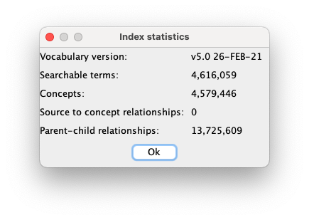

# Installation
Usagi is a stand-alone java application, which requires Java 1.8 or higher to be installed.
Java can be downloaded from <a href="http://www.java.com" target="_blank">java.com</a>.

To get the latest Usagi build, download "Usagi_vx.x.x.jar" under the <a href="https://github.com/OHDSI/Usagi/releases/latest" target="_blank">Releases</a> tab.

After downloading, Usagi can be started simply by double clicking the jar file.
Alternatively, Usagi can be opened from the commandline: `java -jar Usagi_vx.x.x.jar`.

# One-time Setup

The first time you start Usagi, you will be prompted to index the vocabularies.
Usagi does not come with the indexes, you have to provide the vocabulary files.
To do so, follow the folllowing steps:

1. Get the latest version of the vocabulary from [Athena](http://athena.ohdsi.org). An account is required. You can select any vocabularies that you need.
2. When your vocabulary package is ready, download it and unzip the package.
2. Open Usagi as described above.
2. When prompted, specify the location of the downloaded vocabulary files to create the index. \
   The creation of the vocabulary index is a computationally expensive process and can take hours to complete.
3. When finished, the vocabulary version should be displayed in the bottom right. 
   Statistics of your index can be viewed from _Help_ --> _Show index statistics_ 

When switching to a new version of Usagi, the index files can be copied over.
Multiple versions of Usagi can even use the same index.
The Usagi jar file and the index files just need to be in the same folder.

In some cases, Usagi will not be able find the vocabulary index or
the index creation becomes stuck after a few hours (see [issue #64](https://github.com/OHDSI/Usagi/issues/64)).
In both cases, opening Usagi from the commandline might help: `java -jar Usagi_vx.x.x.jar`.

# Support

All source code and installation instructions are available on Usagi’s GitHub site: \
https://github.com/OHDSI/Usagi

Any bugs/issues/enhancements should be posted to the GitHub repository: \
https://github.com/OHDSI/Usagi/issues

Any questions/comments/feedback/discussion can be posted on the OHDSI Developer Forum: \
http://forums.ohdsi.org/c/developers
